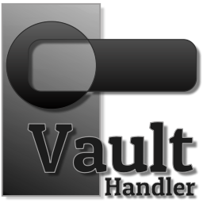

<p align="center">
    
</p>

# `vault-handler` (WIP)

Is a command-line tool to download and manipulate data obtained from
[Vault](https://www.vaultproject.io). The primary-use case of this application is to be used as a
init-container, where is given a manifest file, and based on this manifest, `vault-handler` will
create files accordingly.

## Installing

``` bash
go get -u github.com/otaviof/vault-handler/cmd/vault-handler
```

## HashiCorp Vault

This application is a client of Vault. You can choose either
[AppRole](https://www.vaultproject.io/docs/auth/approle.html) type of authentication, which will
request a runtime token, or directly use a
[pre-requested token](https://www.vaultproject.io/docs/auth/token.html). Both ways are possible, but
AppRole
would be the recommended method.

## Configuration

### Command-Line

After installing, please consider `vault-handler --help` for the command line help text. And the
following parameters are used in command-line:

- `--output-dir`: Output directory, where secret files will be written;
- `--vault-addr`: Vault API endpoint;
- `--vault-token`: Vault API token. Must not be used in combination with `--vault-role-id` or
  `--vault-secret-id`;
- `--vault-role-id`: AppRole role-id;
- `--vault-secret-id`: AppRole secret-id;
- `--dry-run`: Dry-run mode, no data will be written;

All the options in command-line can be set via environment variables. The convention of
environment variable names to add a prefix, `VAULT_HANDLER`, and the option name in capitals,
replacing dashes (`-`) by underscore (`_`). For instance, `--vault-addr` would become
`VAULT_HANDLER_VAULT_ADDR` in environment.

#### Usage

As a example of how to use `vault-handler` in command-line, consider the next example. The manifest
file is the last argument, and you can inform more than one manifest file.

``` bash
vault-handler --output-dir /var/tmp --dry-run <path/to/manifest.yaml>
```

### Manifest

The following snippet is a manifest example.

``` yaml
secrets:
  name:
    path: secret/data/dir1/dir2
    data:
      - name: foo
        extension: txt
        unzip: false
        nameAsSubPath: false
```

Description of the options used in manifest:

- `secrets`: root of the manifest;
- `name`: arbitrary group "name". This group-name is also employed to name final files;
- `name.path`: path in Vault. When using V2 key-value store, you may need to inform
  `/secret/data`, while in V1 API it would be directly `/secret`;
- `name.data.name`: file name;
- `name.data.extension`: file extension;
- `name.data.unzip`: file contents is GZIP, needs to be decompressed;
- `name.data.nameAsSubPath`: employ name as final part of the Vault path `name.path`;

### File Naming Convention

On downloading files from Vault, the following name convention applies:

``` bash
${GROUP_NAME}.${FILE_NAME}.${EXTENSION}
```

Therefore, if you consider the example manifest, it would produce a file named `name.foo.txt` in
the output directory, defined as command line parameter.


